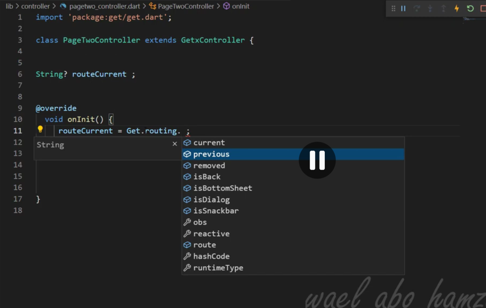

# getx

## flutter getx Learning

### 1. GetX State Management
- GetBuilder
    - best preformance 
    - update reebuild
- GetX
    - if you need it 
    - stream ops
- Obx
    - stream ops 
    - 

### 2. GetX Routing
- Get.to(PageTwo());
- Get.off(PageTwo());
- Get.offAll(PageTwo());
- Get.back();
- Get.offAllNamed("/pageTwo");
- Get.toNamed("/pageTwo");
- Get.offNamedUntil(PageTwo(), (route) => false);
- Get.toNamedUntil(PageTwo(), (route) => false);

### 3. GetX Dependency Injection
{class HomePage extends StatelessWidget {
	
  Controller controller; // create a variable of Controller type
	
  HomePage({this.controller}); // inject Controller dependency through contructor

}

class OtherPage extends StatelessWidget {

  Controller someController = Controller(); // Controller instantiated

  @override
  Widget build(BuildContext context) {
    return Container(
      child: HomePage(controller: someController), // instance of Controller passed to HomePage
    );
  }
}}
    ## first controller instainc >> Inject controller debedncy in constractor 
    ## in get use put its do the same things in esey way
    ## depenndcy injection | put == we dont need initialize controller in every page 
    - Get.put(Controller());
        - permenet to save data in memory *** defult value is false 
        - login , user , email password  
        - on screen is have debendency inj and the souccend have init the controller 
```markdown

```

    - finex ??? 
        - ???
    - Get.find 
        -  
    - Get.lazyPut(() => Controller());
        - mkae init the time of truth
        - call onece time >> or if its in inner page 
```markdown

```
    - Get.putAsync(() => Controller());
        - 
        - async the controller  
    - Get.putAll(Controller());
        - put all the controller in the same time 

    - Buinddings 
        - Bindings are classes where we can declare our dependencies and then ‘bind’ them to the routes. However, this means that we can only use it when using GetX for route management. But that shouldn’t be a problem right? After all, we are in the GetX ecosystem 
        - is box have instance injectable not inject before call this box 
        - call by >>> baidding
        - when app is start by use >>> Home bindding
        - its work ass class , fast 
        #  warring if you use binding for all app when app is start its crach 
                - the slouttion is to use *** lazyPut *** 
### 4. GetX Controller life cycle
    - onInit
        - it like initial state 
    - onReady
        - after state initial 
    - onClose
        - after state close 
    

        - 


### 4. GetX Internationalization

### 5. GetX Theme Management

### 6. GetX Dialogs
- GET.dialog
  - title 
  - titleStyle 
  - middleText 
  - middleTextStyle 
  - content >>>>>
  - contentPadding 
  - actions 
  - actionsAlignment 

  - barrierDismissible 
  - textCancel 
  - textConfirm 
  - onConfirm 
  - onCancel 
  - **content** > its make overide the dialog  and accepet widget 
    - example 
```dart
Get.dialog(
  AlertDialog(
    title: const Text('AlertDialog Title'),
    content: const Text('AlertDialog description'),
    actions: [
      TextButton(
        onPressed: () => Get.back(),
        child: const Text('Cancel'),
      ),
      TextButton(
        onPressed: () => Get.back(),
        child: const Text('OK'),
      ),
    ],
  ),
);
```
    - content accept widget 
      - example 
```dart
Get.dialog(
  AlertDialog(
    title: const Text('AlertDialog Title'),
    <!-- here we can add any widget -->
    content:Column(
      children: [
        TextField(
          decoration: InputDecoration(
            labelText: 'Username',
          ),
        ),
        TextField(
          decoration: InputDecoration(
            labelText: 'Password',
          ),
        ),
      ],
    ),
    actions: [
      TextButton(
        onPressed: () => Get.back(),
        child: const Text('Cancel'),
      ),
      TextButton(
        onPressed: () => Get.back(),
        child: const Text('OK'),
      ),
    ],
  ),
);
```
  -   **cancle** = its mean if you click on the dialog it will close 
    -     the <b>deffrence</b> between cancle and onCancel is >>>>> cancle = if you click on the dialog it will close 
    -     onCancel = if you click on the dialog it will close and do something 
    - use InkWell to make the dialog closable and onCancel to do something  thats why we use InkWell in the dialog  ,, hold on a  sec what is InkWell ?? 
    - **InkWell** is a widget that allows you to add ink splash effect to a widget when it is tapped 
    - 
### 7. GetX Bottom Sheets
  - Get.bottomSheet
    - its like dialog but it is a bottom sheet 
      - example 
```dart
Get.bottomSheet(
  Container(
    height: 200,
    color: Colors.white,
    child: Center(
      child: Text('Bottom Sheet'),
    ),
  ),
);
```
    - 

  - its show from the bottom of the screen in real life senario: 
    - user want to change the language 
    - user want to change the theme 
    - user want to change the font size 
    - user want to change the font style 
    - user want to change the font color 
    - user want to change the font background color 
    - user want to do some action 
      - submit
        - some money transfer  
        - 
      - cancel 
      -  
      - 

### 8. GetX Snackbars
  - Get.snackbar
    - title 
    - message 
    - duration 
      - the time for snackbar
    - icon 
      - the icon for snackbar
    - colorText 
      - the color of the text
    - backgroundColor 
      - the background color of the snackbar
    - 
    
  - the snackbar is a widget that allows you to show a message to the user in a non-intrusive way 
  - is int awosome to use it 
    - you can use it in every where and in reallife seinaro :
      - Login : 
        - if user login success 
        - if user login fail 
        - if user login with wrong password 
        - if user login with wrong email 
        - if user login with wrong email and password 
      - Register : 
        - if user register success 
        - if user register fail 
        - if user register with wrong password 
        - if user register with wrong email 
        - if user register with wrong email and password 
      - to ask the user for permission 
        - location 
        - camera 
        - storage 
        - notification 
        - 
      - to show success message 
      - to show error message 
      - to show warning message 
      - to show info message 
     

### 9. GetX Navigation

### 10. GetX Controllers

### 11. GetX Bindings

### 12. GetX Routes

### 13. GetX Services

### 14. GetX Utils

### 15. GetX Validators

### 16. GetX Middleware
    - privlege system 
    - initial route 
    - decler shaerd preferenc one time in main to use it every ware >> most have async and await  and alwaeys most use >>> widgetsFlutterBinding.ensureInitialized();
```

```
    - to stay save the login data in memory 

    # middleware func
        - GetMiddleware
        - how to use middleware in getx with example 
```dart
```dart
class AuthMiddleware extends GetMiddleware {
  @override
  RouteSettings? redirect(String? route) {
    bool isAuthenticated = true; // Replace with your logic
    return isAuthenticated ? null : const RouteSettings(name: '/login');
  }
}

// Example 2: Using Get.find to access an instance
class SettingMiddleware extends GetMiddleware {
  @override
  RouteSettings? redirect(String? route) {
    if (Get.find<MyService>().sharedPreferences.getString("step") == "1") {
      return const RouteSettings(name: "/home");
    }
    return null;
  }
}

// Usage in GetPage
GetPage(
  name: '/home',
  page: () => const HomeView(),
  middlewares: [
    AuthMiddleware(priority: 1),
    SettingMiddleware(priority: 0),
  ],
)
```

        - priority  by number  if its 1 its most important every time the number is less the priority is high 
        - its not logic its work when app is start 
        - handle notifications , camera prevelges , sound , mice 

    # 


### 00. GET Services and GET View 
    - its rechabel not the all logic is here its work with controller 
    - GET Service its like service in flutter but its more easy to use 
    - GET View its job is to show the UI and handle the events  replace the stateless widget and stateful widget is this relley???? , mybe 
### 00. GET Services and GET View
- **GET Service** – a reusable component that does not contain all the business logic; it works together with a controller.
- **GET Service** is similar to a typical Flutter service but is easier to use.
- **GET View** – its purpose is to display the UI and handle events. It can replace the usual `StatelessWidget`/`StatefulWidget` pattern (is this really what you intend?).


### 00. GET Translations
- its build in in getx see this example
```dart
import 'package:get/get.dart';

class Messages extends Translations {
  @override
  Map<String, Map<String, String>> get keys => {
    'en': {
      'hello': 'Hello World',
      'counter': 'Counter',
      'increment': 'Increment',
    },
    'ar': {
      'hello': 'مرحبا بالعالم',
      'counter': 'العداد',
      'increment': 'زيادة',
    },
  };
}
```

```dart
import 'package:flutter/material.dart';
import 'package:get/get.dart';

void main() {
  runApp(MyApp());
}

class MyApp extends StatelessWidget {
  @override
  Widget build(BuildContext context) {
    return GetMaterialApp(
      translations: Messages(), // your translations
      locale: Get.deviceLocale, // initial locale
      fallbackLocale: Locale('en', 'US'), // fallback locale
      home: HomePage(),
    );
  }
}

class HomePage extends StatelessWidget {
  @override
  Widget build(BuildContext context) {
    return Scaffold(
      appBar: AppBar(
        title: Text('hello'.tr), // GetX translation
      ),
      body: Center(
        child: Column(
          mainAxisAlignment: MainAxisAlignment.center,
          children: [
            Text('counter'.tr),
            ElevatedButton(
              onPressed: () {
                Get.updateLocale(Locale('ar', 'SA')); // switch to Arabic
              },
              child: Text('switch_to_arabic'.tr),
            ),
            ElevatedButton(
              onPressed: () {
                Get.updateLocale(Locale('en', 'US')); // switch to English
              },
              child: Text('switch_to_english'.tr),
            ),
          ],
        ),
      ),
    );
  }
}
```

- local is in materialApp its mean if you change the local in materialApp it will change the local in all the app 
- if you want to change the local in specific page you can use Get.updateLocale(Locale('ar', 'SA')); 
- **local.deviceLocale** its mean the local of the device 
- local.fallbackLocale its mean the local of the app if the local of the device is not found 

- **GET Service** 


### 18. GetX Animations


### Other Advanced APIs -  [https://pub.dev/packages/get#other-advanced-apis](https://pub.dev/packages/get#other-advanced-apis)

### 18. Get Arguments

```dart
// Passing arguments to a route
Get.toNamed('/profile', arguments: {'name': 'John', 'age': 30});

// Receiving arguments in the destination page
class ProfilePage extends StatelessWidget {
  @override
  Widget build(BuildContext context) {
    final Map<String, dynamic> args = Get.arguments;
    return Scaffold(
      appBar: AppBar(title: Text('Profile')),
      body: Center(
        child: Text('Name: ${args['name']}, Age: ${args['age']}'),
      ),
    );
  }
}
```

  - its like the same of the normal navigation but with getx 
    - Get.toNamed('/profile', arguments: {'name': 'John', 'age': 30});
    - Get.arguments
    - Get.offNamed('/profile', arguments: {'name': 'John', 'age': 30});
    

  - the difference between Get.toNamed and Get.offNamed is that Get.toNamed will add the new route to the navigation stack and Get.offNamed will remove the previous route from the navigation stack 
  - in real life senarios: 
    - its used when you want to pass data to the next page 
    - in APIs its used to pass the data from the API to the next page 
      - some apis return the data in the response and you want to pass the data to the next page 
      - async functions its used to pass the data from the API to the next page and wait for the response to be ready before moving to the next page and cache the data in the next page to use it later useing the Get.arguments is powerfull its mean you can use the data in the next page without waiting for the API to be ready 
  - this is simple example: 
    ```dart
    Get.toNamed('/profile', arguments: {'name': 'John', 'age': 30});
    ```
    ```dart
    class ProfilePage extends StatelessWidget {
      @override
      Widget build(BuildContext context) {
        final Map<String, dynamic> args = Get.arguments;
        return Scaffold(
          appBar: AppBar(title: Text('Profile')),
          body: Center(
            child: Text('Name: ${args['name']}, Age: ${args['age']}'),
          ),
        );
      }
    }
    ```


- get.arguments

  - its used to pass data to the next page 

  - GetX Storage
    - its like the same of the normal storage but with getx 
    - GetStorage 
    - GetPrefs 
    - GetPrefs 
  - GetX Dialog 
    - its like the same of the normal dialog but with getx 

  - there job is to check if the snackbar or dialog or bottomsheet is open or not   
    - Get.isSnackbarOpen
    - Get.isDialogOpen
    - Get.isBottomSheetOpen
  - 
- GetPlatform 
  - its job is to check the platform of the device 
  - GetPlatform.isAndroid 
  - GetPlatform.isIOS 
  - GetPlatform.isWeb 
  - GetPlatform.isDesktop 
  - GetPlatform.isMobile 
  - GetPlatform.isTablet

<!-- check the divce Type -->
  - GetPlatform.isWeb 
  - GetPlatform.isDesktop 
  - GetPlatform.isMobile 
  - GetPlatform.isTablet
  

  in real life senarios: 
    - its used when you want to check the platform of the device 
    - in APIs its used to pass the data from the API to the next page 
      - some apis return the data in the response and you want to pass the data to the next page 
      - async functions its used to pass the data from the API to the next page and wait for the response to be ready before moving to the next page and cache the data in the next page to use it later useing the Get.arguments is powerfull its mean you can use the data in the next page without waiting for the API to be ready  
  
<!-- Screen w and h  -->
- Get.size 
- Get.width 
- Get.height 


<!-- isLandscape -->
- Get.isLandscape
  - in real life senarios: 
    - its used when you want to check the orientation of the device 
    - in APIs its used to pass the data from the API to the next page 
      - some apis return the data in the response and you want to pass the data to the next page 
      - async functions its used to pass the data from the API to the next page and wait for the response to be ready before moving to the next page and cache the data in the next page to use it later useing the Get.arguments is powerfull its mean you can use the data in the next page without waiting for the API to be ready  


<!-- isPortrait -->
- Get.isPortrait
  - in real life senarios: 
    - its used when you want to check the orientation of the device 
    - in APIs its used to pass the data from the API to the next page 
      - some apis return the data in the response and you want to pass the data to the next page 
      - async functions its used to pass the data from the API to the next page and wait for the response to be ready before moving to the next page and cache the data in the next page to use it later useing the Get.arguments is powerfull its mean you can use the data in the next page without waiting for the API to be ready  


<!-- getTheme -->
- Get.theme 
- Get.isDarkMode 
- Get.isLightMode 
  - in real life senarios: 
    - its used when you want to check the theme of the app 
    - in APIs its used to pass the data from the API to the next page 
      - some apis return the data in the response and you want to pass the data to the next page 
      - async functions its used to pass the data from the API to the next page and wait for the response to be ready before moving to the next page and cache the data in the next page to use it later useing the Get.arguments is powerfull its mean you can use the data in the next page without waiting for the API to be ready  

<!--  -->
